# API Keys

This page is the single source on which provider keys PolitiClaw uses, what each unlocks, and how to set them. For the runtime status table (which keys are wired today versus declared in schema only), the authoritative source is [Generated Source Coverage](../reference/generated/source-coverage).

```mermaid
graph TB
  apiDataGov["apiDataGov<br/>required for federal data"]
  googleCivic["googleCivic<br/>required for ballot tools"]
  geocodio["geocodio<br/>optional upgrade"]
  zeroKey["Zero-key paths<br/>always available"]

  apiDataGov --> bills["Federal bill search & detail"]
  apiDataGov --> house["House roll-call vote ingest"]
  apiDataGov --> committee["Committee schedule"]
  apiDataGov --> fec["FEC OpenFEC candidate finance"]

  googleCivic --> ballot["Ballot snapshots"]
  googleCivic --> contests["Contest framing"]
  googleCivic --> polling["Polling-place lookup"]
  googleCivic --> dates["Election dates"]

  geocodio --> repsApi["Faster reps-by-address"]

  zeroKey --> senate["Senate roll-call votes<br/>via voteview.com"]
  zeroKey --> shapefile["Reps via local shapefile<br/>(geocodio fallback)"]
```

## Which key unlocks what

Three keys cover the wired runtime today.

| Key | Required? | What it unlocks |
|---|---|---|
| `apiDataGov` | required for federal bills, votes, finance | Federal bill search and detail, House roll-call vote ingest, committee schedule, FEC OpenFEC candidate finance |
| `googleCivic` | required for ballot tools | Ballot snapshots, contest framing, polling-place lookup, election dates |
| `geocodio` | optional | Faster reps-by-address resolution. Without it, the zero-key local shapefile path is used. |

Senate roll-call votes ingest through voteview.com (zero-key), and the local shapefile path covers reps-by-address without `geocodio`. Neither needs configuration beyond running [`politiclaw_configure`](../reference/generated/tools/politiclaw_configure) once.

For the wider set of provider keys declared in the config schema but not yet wired into runtime, see [Generated Source Coverage](../reference/generated/source-coverage). Treat anything not marked `implemented` or `optional_upgrade` as not supported today.

## How to obtain each key

### `apiDataGov`

A free api.data.gov key covers `api.congress.gov` and `api.fec.gov` (and other federal APIs gated through the same gateway). Sign up at [https://api.data.gov/signup/](https://api.data.gov/signup/). The key is issued instantly and has a generous default rate limit.

### `googleCivic`

Google Civic is part of Google Cloud's API set. You enable the "Google Civic Information API" in a Google Cloud project, then create an API key with that API allowed. Google Cloud's own documentation walks through the project creation, API enablement, and key restriction steps; the resulting key is what you save as `googleCivic`.

### `geocodio`

Geocodio is a paid service with a free tier. Create an account on their site and copy the API key from the dashboard.

## How to set keys

`politiclaw_configure` writes keys into the gateway config in two situations:

- Pass any subset of keys directly (`apiDataGov` plus optional `optionalApiKeys`) for "save this one key" calls without re-running the full setup flow. Entries you do not provide are skipped.
- During onboarding, the api-key stage at the end of the wizard prompts for the same keys after address, stances, and monitoring cadence are saved.

Both paths trigger an OpenClaw gateway restart so the new credentials are picked up by the provider adapters. Onboarding fields (address, stances, monitoring mode) are persisted before the restart, so nothing is lost when the gateway comes back up.

After saving, run [`politiclaw_doctor`](../reference/generated/tools/politiclaw_doctor) to confirm the keys are in place and the dependent tools are healthy.

## Practical setup order

1. Add `apiDataGov` first — most tools (bills, votes, finance) depend on it.
2. Add `googleCivic` if you want ballot tools (`politiclaw_get_my_ballot`, `politiclaw_election_brief`).
3. Add `geocodio` only if you prefer the API path for reps-by-address over the zero-key local shapefile path.
4. Re-run `politiclaw_doctor` after any change.

## Troubleshooting pointers

- If a bill, vote, or finance tool returns a missing-key error, see [Troubleshooting → Bill, Vote, Or Finance Tools Are Unavailable](./troubleshooting#bill-vote-or-finance-tools-are-unavailable).
- If a ballot tool reports Google Civic missing, see [Troubleshooting → Ballot Tools Say Google Civic Is Missing](./troubleshooting#ballot-tools-say-google-civic-is-missing).
- For the runtime status of any key (`implemented`, `optional_upgrade`, `schema_only`, `transport_pending`), trust [Generated Source Coverage](../reference/generated/source-coverage) over prose.
