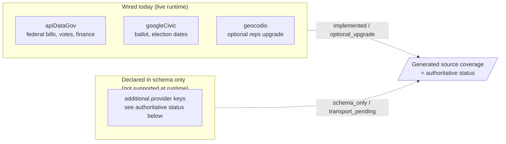

# Configuration

PolitiClaw ships a broader config schema than the current runtime actually uses, so this guide separates live settings from declared-only placeholders. For the keys themselves — what each unlocks, how to obtain them, how to set them, and what the gateway-restart implication is — see [API Keys](./api-keys).

## Wired Today

These keys are active in the current runtime:

- `plugins.politiclaw.apiKeys.apiDataGov`
  - Required for the current federal bill, House roll-call vote, committee schedule, and FEC finance paths.
  - One key covers both api.congress.gov and FEC OpenFEC.
  - Senate roll-call votes use voteview.com (zero-key) and do not require this key.
- `plugins.politiclaw.apiKeys.googleCivic`
  - Required for every ballot and election-logistics lookup today. Google Civic is the only wired ballot source.
- `plugins.politiclaw.apiKeys.geocodio`
  - Optional upgrade for reps-by-address lookup when you want the API path instead of the zero-key local shapefile path.

## Declared In Schema, But Not Live Yet

Additional provider keys exist in the shipped config schema for planned integrations. Do not treat those entries as supported until the generated source coverage page marks them as `implemented` or `optional_upgrade`.

That distinction matters because a config key being present in `openclaw.plugin.json` does not guarantee a runtime adapter is wired today.

## Source Of Truth

Use these generated pages whenever you need exact status:

- [Generated Config Schema](../reference/generated/config-schema)
- [Generated Source Coverage](../reference/generated/source-coverage)

## Practical Setup Order

For most users, the simplest order is:

1. Add `apiDataGov`.
2. Decide whether you need `googleCivic` for ballot workflows.
3. Decide whether you want `geocodio`, or whether the local shapefile path is enough.
4. Re-run [`politiclaw_doctor`](../reference/generated/tools/politiclaw_doctor) after changing config.

For walkthroughs of how to actually save each key (via [`politiclaw_set_api_keys`](../reference/generated/tools/politiclaw_set_api_keys) or the [`politiclaw_configure`](../reference/generated/tools/politiclaw_configure) flow) and what the gateway-restart side effect looks like, read [API Keys](./api-keys).
