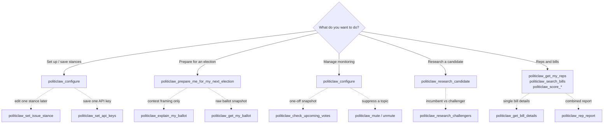

# Entry Points by Goal

Use this page when multiple tools can answer a similar need and you want to know which one should be the default front door.

## Getting set up

### Default entry point

- [`politiclaw_configure`](../reference/generated/tools/politiclaw_configure)

### Why

It bundles the highest-friction setup work into one flow instead of making users manually discover address saving, rep bootstrap, issue stances, and monitoring in separate steps.

### Use the lower-level tools when

- you are editing a single issue later with [`politiclaw_set_issue_stance`](../reference/generated/tools/politiclaw_set_issue_stance)
- you are reviewing or pruning a saved stance set with [`politiclaw_list_issue_stances`](../reference/generated/tools/politiclaw_list_issue_stances) or [`politiclaw_delete_issue_stance`](../reference/generated/tools/politiclaw_delete_issue_stance)
- you want to save or update a single API key without re-running the whole flow with [`politiclaw_set_api_keys`](../reference/generated/tools/politiclaw_set_api_keys) (triggers a gateway restart)

## Ballot and election prep

### Default entry point

- [`politiclaw_prepare_me_for_my_next_election`](../reference/generated/tools/politiclaw_prepare_me_for_my_next_election)

### Why

It is the highest-value answer for most users because it checks prerequisites, pulls ballot context, and combines contest framing with representative context in one output.

### Use the lower-level tools when

- you want a contest-by-contest framing only, use [`politiclaw_explain_my_ballot`](../reference/generated/tools/politiclaw_explain_my_ballot)
- you need the raw ballot snapshot and logistics for debugging or plumbing, use [`politiclaw_get_my_ballot`](../reference/generated/tools/politiclaw_get_my_ballot)

## Monitoring

### Default entry point

- [`politiclaw_configure`](../reference/generated/tools/politiclaw_configure)

### Why

It is the cleanest user-facing control. Most users want one place to save setup and choose how loud monitoring should be, not reason about job installation details.

### Use the lower-level tools when

- you want a one-off snapshot instead of ongoing monitoring, use [`politiclaw_check_upcoming_votes`](../reference/generated/tools/politiclaw_check_upcoming_votes)
- you want to suppress a specific topic without changing cadence, use [`politiclaw_mute`](../reference/generated/tools/politiclaw_mute), [`politiclaw_unmute`](../reference/generated/tools/politiclaw_unmute), and [`politiclaw_list_mutes`](../reference/generated/tools/politiclaw_list_mutes)

### See also

- [Recurring Monitoring](./recurring-monitoring) for what the cadence actually produces over time.
- [Examples of Good Alerts](./example-alerts) for the shape of each job's output.

## Candidate and race research

### Default entry point

- [`politiclaw_research_candidate`](../reference/generated/tools/politiclaw_research_candidate)

### Why

Most user intent starts with a person, not a whole race. The single-candidate tool is easier to explain and works well as a first pass.

### Use the lower-level tools when

- you want side-by-side incumbent versus challenger finance context for a stored race, use [`politiclaw_research_challengers`](../reference/generated/tools/politiclaw_research_challengers)

## Reps and bills

### Default entry points

- [`politiclaw_get_my_reps`](../reference/generated/tools/politiclaw_get_my_reps)
- [`politiclaw_score_representative`](../reference/generated/tools/politiclaw_score_representative)
- [`politiclaw_search_bills`](../reference/generated/tools/politiclaw_search_bills)
- [`politiclaw_score_bill`](../reference/generated/tools/politiclaw_score_bill)

### Why

These pair clean discovery questions with alignment questions. They are the strongest core public surface for ongoing civic use.

### Use the lower-level tools when

- you need a single bill's exact source-backed details, use [`politiclaw_get_bill_details`](../reference/generated/tools/politiclaw_get_bill_details)
- you want a combined report across stored reps, use [`politiclaw_rep_report`](../reference/generated/tools/politiclaw_rep_report)

### See also

- [How PolitiClaw Holds Representatives Accountable](./rep-accountability) for how scoring, digests, and draft outreach fit into one loop.
