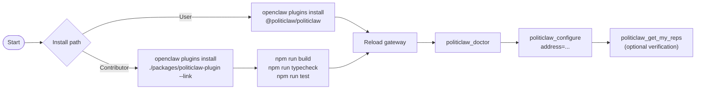

# Installation and Verification



## Install

Install the plugin into a running OpenClaw gateway:

```bash
openclaw plugins install @politiclaw/politiclaw
```

Reload the gateway (or restart the OpenClaw app) to pick up the new tools, then jump to [Runtime Verification](#runtime-verification) to confirm everything is wired up.

## Install from source (contributors)

If you are working on the plugin in this workspace, install from a local checkout instead.

From the repository root:

```bash
npm install
openclaw plugins install ./packages/politiclaw-plugin --link
```

The linked install reads from the source path, so edits land without reinstalling.

Run the standard checks from the repository root:

```bash
npm run build
npm run typecheck
npm run test
```

If you are changing docs metadata or generated reference pages, also run:

```bash
npm run docs:generate
npm run docs:check
```

Start the VitePress app from the workspace root:

```bash
npm run docs:dev
```

## Runtime Verification

After the plugin is installed inside OpenClaw, use the runtime tools to verify the real environment:

1. Run [`politiclaw_configure`](../reference/generated/tools/politiclaw_configure) with your address.
2. Run [`politiclaw_doctor`](../reference/generated/tools/politiclaw_doctor).
3. If you plan to use zero-key rep lookup, `politiclaw_configure` primes the local cache as part of rep resolution.
4. Fetch current reps with [`politiclaw_get_my_reps`](../reference/generated/tools/politiclaw_get_my_reps) if you want a direct verification pass.

## What Counts As Healthy

A healthy install usually looks like this:

- The doctor tool reports working storage and a current schema version.
- Missing keys show up as actionable configuration gaps, not stack traces.
