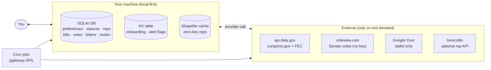

# Privacy and Storage

## Local-First Boundary

PolitiClaw keeps its structured state in plugin-owned local storage. The current runtime uses:

- A plugin-private SQLite database for structured records (preferences, declared stances, stored reps, bills, votes, letters, mutes, reminders, action moments).
- A small key-value table inside the same database for runtime flags such as onboarding progress and alert settings.
- A local shapefile cache for zero-key reps-by-address lookup.

## What Leaves The Machine

External network calls only happen when a tool needs a provider-backed answer. Today that mainly means:

- Federal bills, House roll-call votes, committee schedule, and FEC finance through the shared `api.data.gov` key.
- Senate roll-call votes through voteview.com (no key required).
- Ballot and election-logistics calls through Google Civic, which is the only wired ballot source today.
- Optional Geocodio lookups when you configure that key.

The candidate-bio web-search adapter shape exists, but the production transport is not wired today. The generated source coverage page marks that status explicitly.

## Storage Source Of Truth

Use the generated storage schema page for the exact current database layout:

- [Generated Storage Schema](../reference/generated/storage-schema)

That page is built from a real migrated in-memory database, not from hand-maintained SQL snippets.

## Monitoring State

Monitoring jobs are created through the gateway cron API. The plugin manages its own job names and cadence, but those jobs are not stored inside the plugin database itself. For the exact template names and payloads, see:

- [Generated Cron Jobs](../reference/generated/cron-jobs)

## Docs Site Separation

The VitePress app is a separate static site in the same repository. It is documentation for the plugin, not part of the plugin runtime boundary.
