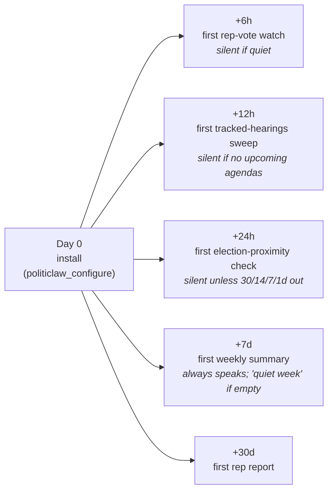

# Recurring Monitoring

This page describes what PolitiClaw does for you *after* setup, when you're not actively asking it anything.

For the controls reference — switching cadence, muting topics, running an immediate snapshot — read [Manage Monitoring](./monitoring). This page is the narrative companion.

## What recurring monitoring means here

Once you've run [`politiclaw_configure`](../reference/generated/tools/politiclaw_configure) with an address and at least one issue stance, PolitiClaw installs a small set of cron templates onto your OpenClaw gateway. They run on their own schedules, on your machine, from then on.

You don't have to manage them. You don't have to re-ask the same question every week. You don't have to remember which bill you were tracking. The templates do their deterministic work (fetch, hash, detect changes, score against your declared stances) and then hand a structured delta to a monitoring skill that decides whether you need to hear about it.

The exact job names, schedules, and payloads live in [Generated Cron Jobs](../reference/generated/cron-jobs) — that page is the source of truth for the current template set.

## What you'll hear from, and when

Each template has a different job. Framed from the user's seat:

### Rep-vote watch (every 6 hours)

Catches new or materially changed federal bills and committee events that touch issues you declared a stance on. Change-detection-gated: a quiet window produces no message. Pair with [`politiclaw_ingest_votes`](../reference/generated/tools/politiclaw_ingest_votes) if you want roll-call context populated for both chambers.

### Tracked hearings (every 12 hours)

Surfaces newly-scheduled committee hearings and markups whose related bills overlap your tracked issues. Silent when nothing tracked is on an upcoming agenda.

### Weekly summary (every 7 days)

One message, readable in about a minute: headline, bills that moved on your stances, what's coming up in the next ten days, a mandatory "things you might be surprised by" section, and a one-line note if a source was unavailable. The format is enforced by [the weekly-digest skill](../reference/generated/skills). Quiet weeks get one line, not a padded digest.

### Rep report (every 30 days)

A deterministic alignment digest of your stored representatives against your declared stances and recorded bill signals. It preserves the alignment disclaimer, flags blind spots explicitly, and never uses narrative web search for vote positions.

### Election proximity alert (daily, mostly silent)

Posts only at 30, 14, 7, and 1 day before an election on your saved ballot. One short line: "Election in N days at [polling place]," pointing at [`politiclaw_election_brief`](../reference/generated/tools/politiclaw_election_brief). Nothing on other days.

## When the first message arrives

Cron jobs fire on their own intervals starting from when you enabled them — they do not run immediately. If you want a read while you wait, use [`politiclaw_check_upcoming_votes`](../reference/generated/tools/politiclaw_check_upcoming_votes) for an on-demand snapshot.

## The quiet-by-design contract

PolitiClaw's default posture is to shut up when nothing changed. The monitoring skill is explicit about this:

- Empty delta → brief confirmation: "No new or materially changed items since last check (checked N bills, M upcoming events)." No padding.
- Source unavailable → one line with the failure reason and any actionable hint. No fabricated summary.
- Partial failure → render what did come back, name the failing sub-source. No pretending.

A noisy monitor gets muted. A silent monitor that says so when something breaks stays trusted.

If you want to suppress a specific topic without changing cadence, use [`politiclaw_mutes`](../reference/generated/tools/politiclaw_mutes). Mutes are additive and auditable — the monitoring loop surfaces a compact "(N items suppressed by mute list)" note so you can always see the filter is active.

## What isn't yet proactive

Deliberate limits so the blind spots don't hide:

- **State and local bills.** Federal bill and roll-call sources are wired (House via api.congress.gov, Senate via voteview.com); state-level providers are declared in the config schema but not wired into runtime today. See [Generated Source Coverage](../reference/generated/source-coverage) for the full matrix.
- **Finance-driven alerts.** FEC campaign-finance lookups are available on demand via the candidate research tool, but no cron template currently fires finance-delta alerts.
- **Outgoing transport.** PolitiClaw posts to your own session; it does not send email, push notifications, or messages to third parties. Outreach ends at a draft you send yourself.
- **Reactive follow-up.** If a rep responds to a letter, PolitiClaw won't notice. The loop is monitoring → draft; it doesn't close around the reply.

When any of these change, the cron-jobs and source-coverage pages will reflect it before this page will.

## See also

- [Manage Monitoring](./monitoring) — the controls reference: modes, mutes, on-demand snapshots.
- [Examples of Good Alerts](./example-alerts) — the shape of each job's output.
- [How PolitiClaw Holds Representatives Accountable](./rep-accountability) — the loop monitoring feeds into.
