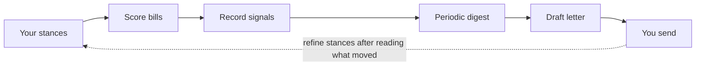

# How PolitiClaw Holds Representatives Accountable

Accountability here isn't a single feature. It's a loop: you declare what you care about, PolitiClaw scores reps and bills against that, records the signals, surfaces drift over time, and hands you a draft letter when you want to push back. Nothing is sent on your behalf.

## The accountability loop

Each arrow is a tool or cron job, not a marketing promise:

1. **Declare stances.** [`politiclaw_configure`](../reference/generated/tools/politiclaw_configure) saves your address, issue stances, and monitoring cadence.
2. **Score on demand or on schedule.** [`politiclaw_score_bill`](../reference/generated/tools/politiclaw_score_bill) and [`politiclaw_score_representative`](../reference/generated/tools/politiclaw_score_representative) score against your declared stances. Recurring jobs keep the picture current.
3. **Signals are recorded locally.** Stance signals land in plugin-owned SQLite on your machine. [Generated Storage Schema](../reference/generated/storage-schema) is the source of truth for layout.
4. **Periodic digest.** The monthly [`politiclaw_rep_report`](../reference/generated/tools/politiclaw_rep_report) re-scores every stored rep deterministically from recorded votes and alignment signals, with blind spots called out.
5. **Close the loop with a draft.** [`politiclaw_draft_outreach`](../reference/generated/tools/politiclaw_draft_outreach) grounds outreach in bill text and your saved stance. You read it, edit it, and send it yourself.

## What "aligned" and "against" actually mean

Alignment here is a recorded claim, not a gut rating.

- **Input is your declared stance set.** If you didn't say you care about a topic, the scorer does not invent a preference for you.
- **Evidence comes from primary sources.** Bill text, status, roll-call votes, and committee activity flow from `api.congress.gov` via the shared `api.data.gov` key. See [Generated Source Coverage](../reference/generated/source-coverage).
- **Scoring carries a confidence floor.** When the scorer can't quote the bill's own text to justify a direction, it reports `direction unclear` rather than guessing.
- **The alignment disclaimer stays attached.** `politiclaw_check_upcoming_votes` emits it whenever scores appear. The monitoring skill is explicit: don't strip it.

That means rep scores on a PolitiClaw report are reproducible from the same inputs, not editorial. If you disagree with a score, the path is to read the cited bill text and either adjust your stance or flag the signal rather than argue with a number.

## The dissenting-view rule

Every multi-item summary PolitiClaw produces must include at least one item that complicates or cuts against your declared stances, when such an item exists. This is enforced by the [monitoring skill](../reference/generated/skills), not optional politeness.

Rules the skill enforces:

- The dissenting item must be sourced tier 1–3 (primary government, neutral civic, or reputable journalism). Advocacy sources are acceptable only if labeled as such.
- If the current delta is genuinely one-directional, the skill says so explicitly — "nothing in this week's delta cuts against your declared stances" — rather than fabricating opposition.
- Tier-5 LLM search output is forbidden for numerical claims, vote tallies, dollar amounts, or status transitions.

Accountability that only tells you what you want to hear is a mirror, not accountability. The dissenting-view requirement is why the weekly digest stays worth reading.

## Source-tier discipline

| Tier | What it is | Example use |
| --- | --- | --- |
| 1 | Primary government | Bill text, roll-call votes, committee schedule — `api.congress.gov` |
| 2 | Neutral civic | Ballot logistics — Google Civic |
| 3 | Reputable journalism | Framing and context — outlet named |
| 4 | Advocacy | Allowed with the group named; explicitly labeled |
| 5 | LLM search / model recall | Narrative framing only; forbidden for numerics |

The monitoring skill enforces these tiers on every factual claim it emits. If a claim can't be pinned to tier 1–2, it either gets downgraded in framing or dropped.

## Closing the loop: drafts, not sends

The outreach path ends at a draft. [`politiclaw_draft_outreach`](../reference/generated/tools/politiclaw_draft_outreach) grounds a letter in the specific bill text and your saved stance so the draft reads like you wrote it after doing the homework. You review, edit, and send it yourself through whatever channel you normally use.

For the broader outreach workflow — public comments, testimony, choosing a representative target — see [Draft Outreach](./draft-outreach).

There is no "send on your behalf" path today. That is a deliberate choice: transport layers create identity and authentication surface we have not built honestly yet, and a draft you review is less likely to misrepresent you than an autosent form letter.

## Where accountability has limits today

Be concrete about what this does *not* cover yet:

- **State and local reps.** The federal reps-by-address and scoring paths are wired (House votes via api.congress.gov, Senate votes via voteview.com). State and municipal providers are declared in the config schema only — check [Generated Source Coverage](../reference/generated/source-coverage) for the current matrix.
- **Committee behavior.** Hearing and markup schedules are surfaced; inside-committee vote records beyond the public roll call aren't ingested.
- **Follow-up on responses.** If a representative replies to your letter, PolitiClaw won't notice. The loop surfaces drift from their votes and bill signals, not from their communications back to you.
- **Finance-triggered alerts.** FEC lookups are available on demand for candidate research; there's no cron template that fires a "large new donor reported" proactive signal.

When any of those change, the generated reference pages update before this narrative does. [Generated Source Coverage](../reference/generated/source-coverage) is the matrix to check.

## In the accountability loop

This page is the synthesis — the loop with the diagram, the disciplines, and the limits. The operational sides:

- [See How My Reps Align](./see-how-my-reps-align) — the operational entry point: get reps, score one, score the whole delegation.
- [Track Bills and Votes](./track-bills-and-votes) — where the evidence comes from before any scoring runs.
- [Examples of Good Alerts](./example-alerts) — what the recurring rep report and weekly digest actually look like over time.
