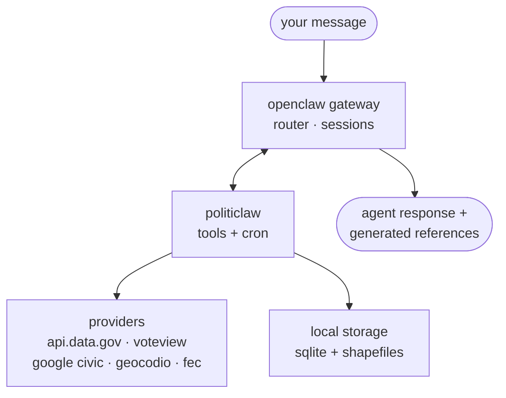

overview/politiclaw

<section class="pc-hero">
  
overview · v0.0.4 · openclaw plugin

  <h1 class="pc-hero-h1">
    
    politiclaw
  </h1>

  

    Holds your representatives accountable to the values you declare.
    Generated reference where accuracy matters. Short guides where judgment matters.
  

  

    PolitiClaw is a <strong>local-first civic copilot</strong> — an OpenClaw plugin that learns the stances you care about, watches federal legislation and your reps' roll-call votes (House and Senate) for you, and flags when their actions align (or don't) with those stances. It drafts letters you send yourself; it never speaks on your behalf and never tells you how to vote. The docs split into a narrative <strong>guide</strong> you read end-to-end and a <strong>reference</strong> generated from the current implementation.
  

  

    <a href="/guide/getting-started" class="pc-btn primary">get started →</a>
    <a href="/guide/entry-points-by-goal" class="pc-btn secondary">browse by task</a>
    <a href="/reference/tools" class="pc-btn ghost">browse reference</a>
  

  

     v0.0.4 · local-first
    openclaw plugin
    us federal · google civic ballots
  

</section>

  <a class="pc-card" href="/guide/see-how-my-reps-align">
    
01 · task

    
see how my reps align

    
The accountability spine — measure your federal delegation against the stances you declared, with cited votes and honest coverage gaps.

    →
  </a>
  <a class="pc-card" href="/guide/getting-started">
    
02 · start

    
getting started

    
Read the two-pass layout of the site and the shortest path from a fresh install to a real answer.

    →
  </a>
  <a class="pc-card" href="/guide/track-bills-and-votes">
    
03 · task

    
track bills &amp; votes

    
Use the bill search and scoring path when the main question is what changed and why it matters.

    →
  </a>

<section id="what">
<h2 class="pc-h2">what is politiclaw?</h2>

  PolitiClaw is a <strong>local-first civic copilot</strong> that holds your representatives accountable to the values you declare. It learns the stances you care about, watches federal legislation and federal roll-call votes (House and Senate) on your behalf, and flags when your reps' actions align — or don't — with those stances. Ballot prep, candidate finance research, and draft-only outreach all build on the same stance-driven loop. Your queries never touch a third-party political platform.

  Everything structured lives in plugin-owned storage on your machine. Outbound network calls happen only when a tool needs a provider-backed answer, and the <a href="/reference/source-coverage">source coverage page</a> is explicit about which providers are wired today versus declared in schema only.

  honest scope
  

    Outreach is <strong>draft-only</strong> — PolitiClaw never sends mail, posts on your behalf, or routes your message through a political platform, so accountability stays in your hands instead of a vendor's. Coverage today is federal: bills and House roll-call votes through api.congress.gov, Senate roll-call votes through voteview.com, ballots through Google Civic. State legislation and local races are not yet wired; the docs distinguish wired providers from optional upgrades, transport-pending adapters, and schema-only placeholders. For the goal-indexed scope boundaries, see <a href="/reference/source-coverage#what-is-not-covered-today">current coverage</a>.
  

</section>

<section id="how">
<h2 class="pc-h2">how it works</h2>

  The plugin registers three things with your OpenClaw gateway: a pool of <strong>provider adapters</strong> (api.data.gov for federal bills, House votes, and FEC finance; voteview.com for Senate votes; Google Civic for ballots; Geocodio as an optional rep-lookup upgrade), a <strong>tool bundle</strong> the agent can call (<code>politiclaw_doctor</code>, <code>politiclaw_configure</code>, <code>politiclaw_issue_stances</code>, <code>politiclaw_get_my_reps</code>, <code>politiclaw_election_brief</code>, …), and a set of <strong>cron templates</strong> the gateway schedules for monitoring.

  <strong>providers</strong>: external network sources reached only when a tool needs a provider-backed answer (api.congress.gov, voteview.com, Google Civic, Geocodio, FEC). <strong>local storage</strong>: plugin-owned files on your machine (SQLite database for structured records; cached shapefiles for the zero-key reps-by-address path).

  For the exact runtime wiring, read the <a href="/maintainers/architecture">architecture notes</a> and the <a href="/reference/source-coverage">source coverage matrix</a>.

</section>

<section id="capabilities">
<h2 class="pc-h2">what ships today</h2>

  

    
01

    
representative accountability

    
Per-rep and per-issue alignment scoring against your declared stances, driven by deterministic matching of House and Senate roll-call votes to the bills you have signal on. Confidence floor preserves "insufficient data" honesty; state/local accountability is not claimed.

  

  

    
02

    
federal bills &amp; congressional votes

    
The evidence base. Bills, House roll-call votes, and committee schedules through the shared <code>api.data.gov</code> key against api.congress.gov; Senate roll-call votes through voteview.com (zero-key).

  

  

    
03

    
rep finder

    
Reps-by-address with a zero-key local shapefile path, or the Geocodio API path when you configure that key. Needed before any accountability score can be computed.

  

  

    
04

    
ballot &amp; election prep

    
Contest-by-contest prep for upcoming elections via Google Civic — the only wired ballot source today.

  

  

    
05

    
recurring monitoring

    
Plugin-owned cron templates plus a saved cadence that controls which default jobs stay enabled. Feeds the weekly digest and monthly rep report — see <a href="/guide/recurring-monitoring">recurring monitoring</a> for what the jobs do over time.

  

  

    
06

    
candidate finance research

    
FEC OpenFEC lookups through the same <code>api.data.gov</code> key, scoped for candidate and committee research.

  

  

    
07

    
draft-only outreach

    
Drafts letters, public comments, and testimony grounded in the bill text and your own saved stance — you send them yourself.

  

</section>

<section id="quickstart">
<h2 class="pc-h2">first successful run</h2>

  
01install

  

    
link the plugin locally

    
From the repository root:

<pre>npm install
openclaw plugins install ./packages/politiclaw-plugin --link</pre>
  

  
02verify

  

    
check the workspace and runtime

    
Run the standard checks, then verify the real environment with the doctor tool:

<pre>npm run build
npm run typecheck
npm run test
# then, from inside openclaw:
politiclaw_doctor</pre>
  

  
03seed

  

    
run configuration once, then verify reps

    
Use the single setup tool to save your address, prime the zero-key path if needed, and load reps.

<pre>politiclaw_configure "address=..."
politiclaw_get_my_reps   # optional direct verification</pre>
  

Need the long version? See <a href="/guide/installation-and-verification">installation &amp; verification</a> and <a href="/guide/configuration">configuration</a>.

</section>

<section id="trust">
<h2 class="pc-h2">sources &amp; trust</h2>

  Runtime-backed reference pages — tools, config schema, source coverage, cron jobs, skills, storage schema — are generated from the current implementation. Prose guides stay short and practical because the exact facts live in the generated pages next door.

  not legal
  

    <strong>PolitiClaw is not legal advice.</strong> It helps you find, read, and act on public-record civic information. For legal interpretation, talk to a lawyer; for voting rules, trust your Secretary of State over the bot.
  

  privacy
  

    Structured state stays in plugin-owned local storage. External calls happen only when a tool needs a provider-backed answer. See <a href="/guide/privacy-and-storage">privacy &amp; storage</a> for the full boundary.
  

</section>

<section id="start-here">
<h2 class="pc-h2">start here</h2>

  <a class="pc-card" href="/guide/see-how-my-reps-align">
    
01 · task

    
see how my reps align

    
The accountability spine — find your delegation, score each rep against your declared stances, and read the per-issue breakdown with cited votes.

    →
  </a>
  <a class="pc-card" href="/guide/understand-my-ballot">
    
02 · task

    
understand my ballot

    
Fold accountability context into the next ballot. Start with the highest-value ballot workflow instead of piecing it together yourself.

    →
  </a>
  <a class="pc-card" href="/guide/research-candidates">
    
03 · task

    
research candidates

    
Start from the single-candidate workflow before opening the more detailed race-comparison path.

    →
  </a>
  <a class="pc-card" href="/guide/draft-outreach">
    
04 · task

    
draft outreach

    
Turn accountability findings, bill research, or ballot prep into a draft the user can send themselves.

    →
  </a>
  <a class="pc-card" href="/guide/recurring-monitoring">
    
07 · experience

    
recurring monitoring

    
What the recurring monitoring jobs actually produce — when they speak, when they stay silent, what each one watches.

    →
  </a>
  <a class="pc-card" href="/guide/rep-accountability">
    
08 · experience

    
how accountability works

    
The loop from declared stances through scored reps to a draft letter you send yourself. Includes the dissenting-view rule.

    →
  </a>
  <a class="pc-card" href="/guide/example-alerts">
    
09 · experience

    
example alerts

    
What a well-formed rep-vote hit, weekly digest, and quiet-window silence look like — and what a bad alert would look like.

    →
  </a>
  <a class="pc-card" href="/guide/monitoring">
    
10 · task

    
manage monitoring

    
Use cadence as the main control for the weekly digest and the monthly rep accountability report.

    →
  </a>
  <a class="pc-card" href="/guide/configuration">
    
11 · config

    
configuration

    
Live keys (<code>apiDataGov</code>, <code>googleCivic</code>, <code>geocodio</code>) separated from schema-only placeholders.

    →
  </a>
  <a class="pc-card" href="/reference/tools">
    
12 · reference

    
runtime reference

    
Drop to the generated reference when you need exact tool schemas, config keys, or source coverage facts.

    →
  </a>

</section>

  <a class="nav-btn next" href="/guide/getting-started">
    
next →

    
getting started

  </a>

