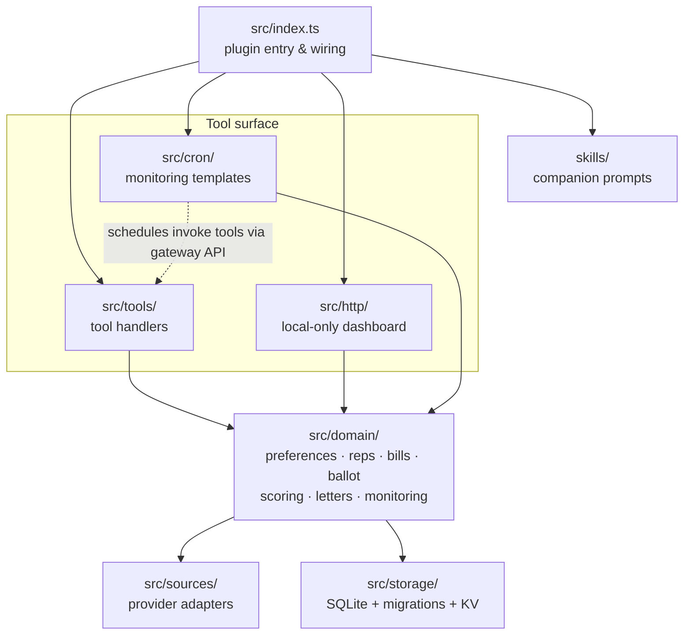

# Architecture

## Current Runtime Shape

The current plugin is centered on tool registration plus a few supporting layers:

- `packages/politiclaw-plugin/src/index.ts` wires storage and registers the runtime tool registry.
- `packages/politiclaw-plugin/src/tools/*` exposes the public tool surface.
- `packages/politiclaw-plugin/src/domain/*` holds the behavior behind those tools.
- `packages/politiclaw-plugin/src/sources/*` contains provider adapters and resolver selection logic.
- `packages/politiclaw-plugin/src/storage/*` owns SQLite, key-value helpers, and migrations.
- `packages/politiclaw-plugin/src/cron/*` owns the plugin-managed monitoring templates and gateway adapter logic.
- `packages/politiclaw-plugin/src/http/*` registers the local-only dashboard served under `/politiclaw`. It serves static HTML/JS/CSS, a JSON `/api/status` payload, and POST endpoints for editing preferences, toggling monitoring jobs, recording stance signals, and flagging letters for re-draft. POST traffic is protected by a double-submit CSRF token (`pc_csrf` cookie paired with the `X-PolitiClaw-CSRF` header).
- `packages/politiclaw-plugin/skills/*` contains the companion skill prompts.

## What The Runtime Does Not Currently Include

There is no long-running background service beyond the gateway-owned cron scheduler. The dashboard is local-only — the plugin registers it with `auth: "plugin"` and adds no gateway-side authentication. Operators who expose the gateway off-host are responsible for fronting the dashboard themselves.

## Docs-Relevant Source Of Truth

The living-docs system is intentionally tied to code-owned metadata:

- `packages/politiclaw-plugin/src/docs/toolRegistry.ts`
- `packages/politiclaw-plugin/src/docs/sourceCoverage.ts`
- `packages/politiclaw-plugin/scripts/docs.mts`

That setup keeps the runtime registry and the generated reference pages aligned.
