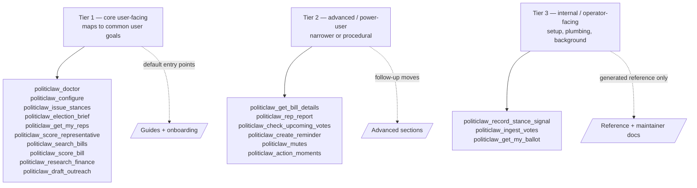

# Tool Surface Policy

## Why this exists

PolitiClaw currently exposes a broad runtime tool surface. That is useful for agents and maintainers, but it is too noisy for most humans if every tool is presented as a first-class entry point.

This page defines the visibility tiers we use when deciding:

- which tools belong in primary docs
- which tools stay available but move to power-user docs
- which tools should remain in generated reference only

The generated tool reference is still the source of truth for everything wired today. This policy only changes how prominently we present each tool.

## Tier 1, core user-facing

Use this tier for tools a normal user might reasonably ask for by intent, even if they do not know the tool name yet.

Criteria:

- maps to a common user goal
- safe to recommend as a default entry point
- minimal setup or low operational complexity
- should appear in guides, onboarding flows, and task-based navigation

Examples:

- `politiclaw_doctor`
- `politiclaw_configure`
- `politiclaw_issue_stances`
- `politiclaw_election_brief`
- `politiclaw_get_my_reps`
- `politiclaw_score_representative`
- `politiclaw_search_bills`
- `politiclaw_score_bill`
- `politiclaw_research_finance`
- `politiclaw_draft_outreach`

## Tier 2, advanced / power-user

Use this tier for tools that are genuinely useful, but are narrower, more procedural, or better as follow-up moves after a core workflow.

Criteria:

- useful to an engaged or returning user
- exposes more raw detail than most users need
- better as a deep-link than a homepage or onboarding entry point
- belongs in reference and advanced guides, not the default happy path

Examples:

- `politiclaw_get_bill_details`
- `politiclaw_rep_report`
- `politiclaw_check_upcoming_votes`
- `politiclaw_create_reminder`
- `politiclaw_mutes`
- `politiclaw_action_moments`

## Tier 3, internal / operator-facing

Use this tier for tools that exist mainly to support setup, maintenance, background jobs, or internal state transitions.

Criteria:

- mainly useful to maintainers, operators, or advanced debugging flows
- implementation plumbing rather than a user goal
- should remain callable and documented in generated reference
- should usually be omitted from primary guides and homepage callouts

Examples:

- `politiclaw_record_stance_signal`
- `politiclaw_ingest_votes`
- `politiclaw_get_my_ballot`

## Presentation rules

When adding or revising docs:

1. Start by choosing the tool's visibility tier.
2. Only Tier 1 tools should appear as default entry points in task-based guides.
3. Tier 2 tools can appear as follow-ups, sidebars, or advanced sections.
4. Tier 3 tools should stay in generated reference and maintainer docs unless there is a strong reason to surface them.
5. A tool can stay public and supported without being nav-prominent.

## Relationship to generated reference

The generated reference answers, "What exists?"

This policy answers, "What should humans see first?"

Keep those two concerns separate. Do not delete a useful low-level tool only because it is not part of the primary surface area.
